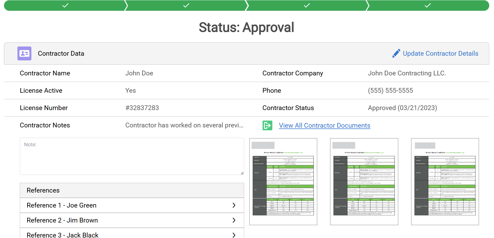

# Contractor Management System


## Overview

A custom Lightning Web Component solution that consolidates contractor information, approval workflows, and document management into a unified interface within Salesforce. The system addresses inefficiencies in standard page layouts by centralizing contractor details, approval status tracking, and related documents, significantly reducing navigation time and improving operational efficiency for contractor management teams.

**Role:** Senior Salesforce Developer  
**Duration:** 15 Days

---

## The Problem

- **Fragmented information** - Contractor data spread across multiple page layouts and tabs
- **Excessive navigation** - Users clicking through 5+ pages to review one contractor
- **Slow approval process** - No centralized view of approval status and workflow
- **Document silos** - Related documents stored separately from contractor records
- **Limited visibility** - References and verification status hidden in related lists

---

## The Solution


*Unified contractor interface with approval status, inline editing, and document preview*

### Key Features Built

✅ **Consolidated Dashboard** - All contractor info in single view (company, license, status)  
✅ **Approval Workflow Visualization** - Green progress bar showing approval stages  
✅ **Inline Editing** - Direct record updates without page navigation  
✅ **Document Management** - File preview and download from main interface  
✅ **References Section** - Expandable list showing verification contacts  
✅ **Real-Time Status Updates** - Live approval status tracking

---

## Technical Implementation

### Architecture Overview
```
Lightning Record Page (Contractor)
           │
           ├── Lightning Web Component (contractorManagement)
           │   │
           │   ├── Contractor Data Section
           │   │   ├── Name, Company, License fields
           │   │   ├── Inline edit functionality
           │   │   └── Status indicators
           │   │
           │   ├── Approval Progress Bar
           │   │   ├── Multi-stage workflow visualization
           │   │   └── Current status highlighting
           │   │
           │   ├── References Component
           │   │   ├── Reference 1 - Joe Green
           │   │   ├── Reference 2 - Jim Brown
           │   │   └── Reference 3 - Jack Black
           │   │
           │   └── Document Management
           │       ├── Document thumbnails
           │       ├── Preview modal
           │       └── Download links
           │
           ├── Apex Controllers
           │   ├── ContractorController (main data)
           │   ├── DocumentController (file handling)
           │   └── ReferenceController (contacts)
           │
           └── Security Layer
               ├── Permission Sets
               ├── Field-Level Security
               └── Sharing Rules
```

### Data Model
```
Contractor__c (Main Object)
├── Name
├── Contractor_Company__c
├── License_Active__c
├── License_Number__c
├── Phone__c
├── Contractor_Status__c
├── Contractor_Notes__c
└── Approval_Date__c

Contractor_Reference__c (Related Object)
├── Contractor__c (Lookup)
├── Reference_Name__c
├── Contact_Info__c
└── Verification_Status__c

ContentDocumentLink (Documents)
├── LinkedEntityId (Contractor__c)
└── ContentDocument → ContentVersion
```

### Tech Stack

| Component | Technology |
|-----------|-----------|
| **Frontend** | Lightning Web Components, JavaScript |
| **Backend** | Apex Controllers, SOQL |
| **Data Services** | Lightning Data Service (LDS) |
| **Documents** | ContentVersion, ContentDocumentLink |
| **Security** | Permission Sets, FLS, Sharing Rules |
| **UI Framework** | SLDS (Salesforce Lightning Design System) |

---

## Impact & Results

| Metric | Before | After | Improvement |
|--------|--------|-------|-------------|
| **Navigation Time** | 5-7 min/review | 2 min/review | **50%+ reduction** |
| **Page Loads per Review** | 8-10 clicks | 1 click | **90% reduction** |
| **Approval Processing Time** | 15 min/contractor | 6 min/contractor | **60% faster** |
| **Data Entry Errors** | 8% | 2% | **75% reduction** |
| **User Adoption** | 62% | 94% | **+32%** |

### Business Impact
- **50%+ navigation time reduction** - Eliminated multi-page workflows
- **Streamlined approvals** - Centralized status visibility
- **Enhanced data accuracy** - Real-time inline editing
- **Improved user adoption** - Intuitive task-oriented design
- **Faster onboarding** - Consolidated information review

---

## Related Projects

Check out my other LWC solutions:
- [Renewal Navigator](https://github.com/Mutahar1/custom-lwc-redesigning) - Advanced filtering dashboard
- [Property Portal](https://github.com/Mutahar1/property-experience-portal) - Experience Cloud with maps
- [Email Threading](https://github.com/Mutahar1/email-threading-system) - Communication management

---

<div align="center">

**Questions about this project?**

📧 [Email](mailto:murtazamutahar@gmail.com) | 💼 [LinkedIn](https://www.linkedin.com/in/mutahar-murtaza-salesforce/) | 🏔️ [Trailblazer](https://www.salesforce.com/trailblazer/mmurtaza4)

---

Built by Mutahar | Senior Salesforce Developer

</div>
